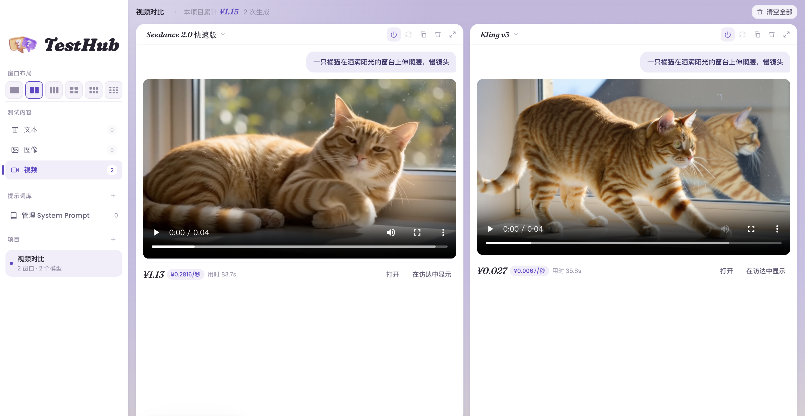
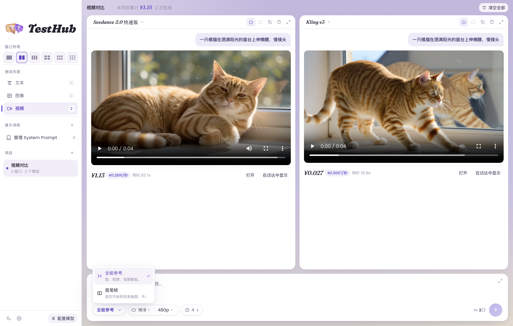
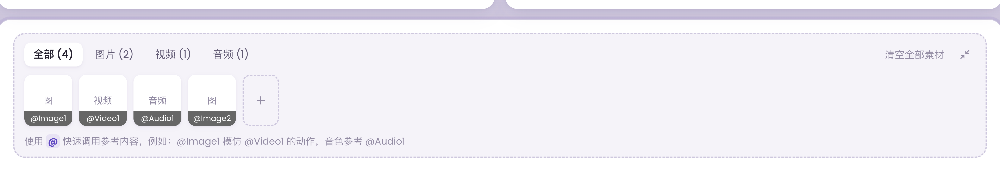
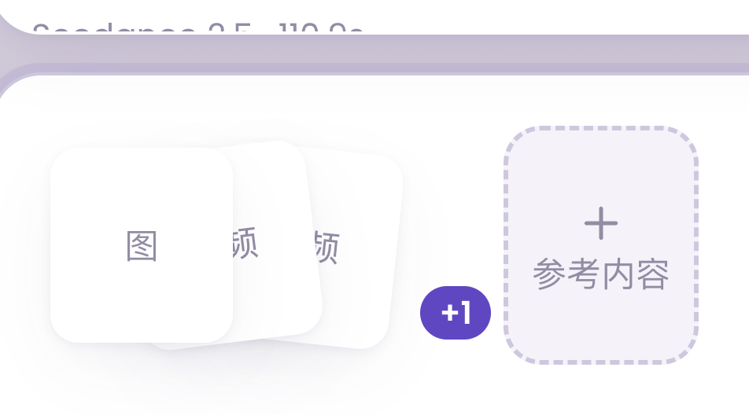
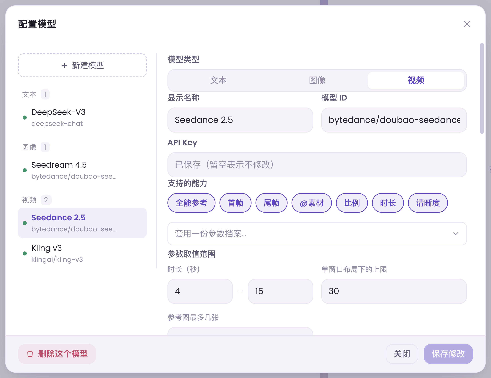

# TestHub

**多模型并行测试台** —— 一条提示词，同时发给多个模型窗口，横向对比结果。
文本、图像、视频三类都能测；生成类还会把接口返回的**花费**和**每秒单价**直接摆在结果下面。



自带模型的用户自带 API Key。**本仓库不含任何密钥或数据，装好就是一个全新的空白产品**，所有配置由你自己填。

## 为什么做它

市面上的对比工具（如 ChatHub）大多只测文本，而且不能设 System Prompt。TestHub 补上了这几件事：

- **三层 System Prompt**：模型级默认 → 窗口级临时 → 一键同步到全部窗口
- **图像 / 视频生成对比**：同一提示词多模型并行出片，价格、每秒单价、用时一行看完
- **参数按模型自适应**：每个模型登记自己支持的能力和取值范围，界面只显示真正会生效的控件 —— 生成类每次都是真花钱，不让你填一个白填的值

## 功能一览

### 项目与布局

- 侧栏顶部按**文本 / 图像 / 视频**分模块，项目列表跟着模块走
- 窗口布局 1 / 2 / 3 / 4 / 6 / 9，每个项目各自记住
- **聚焦模式**：双击窗口标题放大为主体，其余收进右侧列，`Esc` 还原
- 项目 = 完整测试现场（布局 + 模型绑定 + System Prompt + 记录），切换互不打扰；切走时正在跑的请求照常完成

### 生成模式（视频）



| 模式 | 说明 |
| --- | --- |
| **全能参考**（默认） | 图、视频、音频都能当参考，提示词里用 `@Image1` `@Video1` `@Audio1` 引用；什么都不传就是文生视频 |
| **首尾帧** | 指定开始和结束画面，中间由模型补全，两帧可一键互换 |

模式和模型双向联动：切到某模式后，**不支持它的模型在下拉里不出现**；已绑定的不支持模型会**整窗标红**并说明原因，发送前还会再拦一道。

### 参考素材



- 一张「+ 参考内容」卡搞定三类素材，选文件后按扩展名自动归类、自动编号
- 素材多了自动**叠成一摞**，悬停查看全部，点开是带类型分页的面板
- 本地图片直接内联发送；大视频 / 音频用「粘贴地址」走公网 URL



### 价格显示

每条生成结果下方：**¥金额 · ¥每秒单价 · 用时**；顶栏实时累计本项目总花费。
金额从接口响应里按你配置的 JSON 路径提取（如 `usage.amount`），接口不给金额也可以配「消耗量 × 单价」换算。

### 输入区

- 素材卡片贴左、参数胶囊在底栏，高度恒定不跳动
- 右上角展开按钮：输入区**向上盖在窗口网格上**，不推挤布局
- 时长是滑杆面板，范围跟着当前绑定的模型走；比例 / 清晰度 / 尺寸是各模型取值的**并集**，不被所有模型支持的值会标注「XX 不支持」，选了冲突值发送时点名拦截

## 接入模型



侧栏左下「配置模型」：左栏按类型分组导航，右栏编辑；支持删除、换 Key、换地址。

### 文本模型

任何 **OpenAI 兼容协议**都能接：Base URL + API Key + 模型 ID。
内置模板：OpenAI、DeepSeek、通义千问、Kimi、智谱 GLM、火山方舟、硅基流动、OpenRouter、Ollama。
支持 `reasoning_content` 思维链折叠、推理强度（`reasoning_effort` 三档）、temperature、max_tokens。

### 图像 / 视频模型

这两类没有统一协议，所以把**请求体模板 + 取值路径**全部开放：

| 字段 | 说明 |
| --- | --- |
| 提交地址 / 请求体模板 | JSON 模板，占位符 `{{model}}` `{{prompt}}` `{{duration}}` `{{ratio}}` `{{resolution}}` `{{size}}` `{{seed}}`；图片素材经 `{{imageItems}}`（带 role 的 content 项）或 `{{imageUrls}}` `{{videoUrls}}` `{{audioUrls}}`（平铺数组）注入，两种主流网关格式都覆盖 |
| 轮询地址 | `{{id}}` 占位任务 id；**留空 = 同步接口** |
| 状态 / 结果 / 报错 / 金额路径 | 点号取值（`data.output[0].url`），字段值本身是 JSON 字符串会自动再解析 |
| 支持的能力 | 勾选后输入区才显示对应控件（首帧、尾帧、@素材、比例、时长、清晰度、尺寸） |
| 参数取值范围 | 每个模型自己的合法值；多窗口混绑时取交集校验 |

预设里的提交地址是占位符，替换成你自己网关的地址即可；模板结构和取值路径都已按真实接口验证过。


## 快速开始

```bash
npm install
npm run dev          # 开发运行
npm run start        # 构建后本地运行
npm run dist:mac     # 打包 dmg（打包前自动跑数据泄漏自检）
```

打包产物未签名：macOS 15+ 首次打开需在「系统设置 → 隐私与安全性」点「仍要打开」，或：

```bash
xattr -dr com.apple.quarantine /Applications/TestHub.app
```

## 数据与安全

- 所有 API 请求由**主进程直连**你填写的地址，不经过任何第三方
- **密钥不出主进程**：主进程维护模型登记表，渲染进程只能传模型 id，目标地址由主进程解析 —— 即使渲染进程被注入代码也无法把密钥送去别的服务器
- API Key 经**系统钥匙串**（macOS Keychain / Windows DPAPI）加密，单独存放；配置文件落盘前剥掉一切密钥形态字段
- 报错文本中的密钥自动打码；配置 / 密钥文件以 0600 写入
- 生产构建 CSP 锁死渲染进程（`connect-src 'self'`）
- 生成的媒体下载到本地数据目录（接口链接通常 24 小时失效），本地文件丢失自动回退原始链接
- 数据目录可迁移（设置 → 数据存放位置），支持多机共用
- `npm run preflight` 在每次打包前扫描产物，确保不带任何个人数据

## 项目结构

```
electron/main.js       主进程：窗口、IPC、SSE 流式客户端、生成类提交/轮询/下载、密钥加密、thmedia 媒体协议
electron/preload.js    contextBridge 暴露的 window.api
src/store.ts           zustand 状态机 + 流式增量 rAF 批处理 + 持久化
src/lib/presets.ts     服务商模板与已实测的生成预设
src/lib/genModes.ts    生成模式定义（全能参考 / 首尾帧）
src/lib/paramProfiles.ts 各模型参数档案（实测边界标注来源）
src/components/        侧栏、窗口、输入区、配置弹窗、素材面板等
scripts/preflight-pack.mjs 打包前个人数据自检
```

## 已知边界

- 文本仅支持 OpenAI 兼容协议；Anthropic / Gemini 原生 API 可先经 OpenRouter 使用
- 生成类接新服务需自己填模板与路径，预设只含实测过的
- 部分网关对个别模型的适配不完整，属网关侧限制
- 视频 / 音频参考素材的管道已就绪，但各家接口是否受理需按服务商实测
